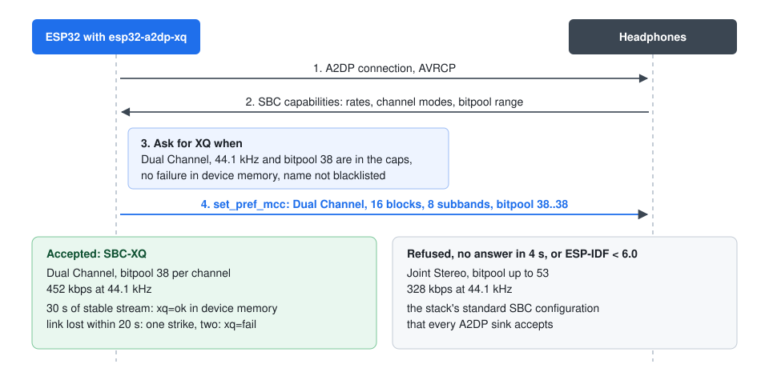

# esp32-a2dp-xq

ESP32 library that sends audio to Bluetooth headphones over A2DP with SBC-XQ: Dual Channel SBC at bitpool 38, 452 kbps at 44.1 kHz, with fallback to Joint Stereo bitpool 53 (328 kbps) for headphones that refuse it.

[](https://github.com/olerast67/esp32-a2dp-xq/actions/workflows/ci.yml)
[](https://components.espressif.com/components/olerast67/esp32-a2dp-xq)
[](LICENSE)

[Русская версия](README.ru.md) · [API reference](https://olerast67.github.io/esp32-a2dp-xq/) · [Changelog](CHANGELOG.md)



## Status

Version 0.1.0 has not been run on hardware yet. The first hardware test will go into the changelog with the headphone models.

What is verified:

- 1315 checks in the host tests pass: SBC frame length and bitrate, the bitpool search of the Bluedroid encoder, the XQ decision from the headphone capabilities, the PCM FIFO with underruns and flushes, the volume scales, the device memory file and a parser fuzz pass.
- CI builds the ESP-IDF examples for the ESP32 with ESP-IDF 5.3, 5.5, 6.0 and 6.1 with Bluetooth Classic enabled, and for the ESP32-S3, where the library builds without Bluetooth Classic and reports it as unsupported. Warnings in the library fail the build.
- CI builds the Arduino examples with the Arduino core 3.1.3 (ESP-IDF 5.3) and the latest core, and with PlatformIO.

## Comparison

| | esp32-a2dp-xq | [ESP32-A2DP](https://github.com/pschatzmann/ESP32-A2DP) |
|---|---|---|
| SBC-XQ, Dual Channel bitpool 38, 452 kbps | Yes, ESP-IDF 6.0+ | No |
| Standard SBC, Joint Stereo bitpool 53 | Yes | Yes |
| Input | 16-bit, or 32-bit with TPDF dither to 16 | 16-bit |
| Per-device XQ memory and blacklist | Yes | No |
| ESP32 as a Bluetooth speaker (A2DP sink) | No | Yes |
| Arduino `Stream` and AudioTools integration | No | Yes |
| Tested on hardware | Not yet | Yes |

ESP32-A2DP is the library to take for a Bluetooth speaker or for a quick start with AudioTools. This library covers the source direction only and adds the higher SBC bitrate.

## Quick start

```c
#include "a2dp_xq.h"

void app_main(void) {
    nvs_flash_init();                                   // bonding keys live in NVS
    a2dp_xq_config_t cfg = A2DP_XQ_CONFIG_DEFAULT();
    cfg.device_name = "My ESP32";
    a2dp_xq_init(&cfg);
    a2dp_xq_connect("aa:bb:cc:dd:ee:ff");               // or a2dp_xq_scan(true)
    a2dp_xq_start();
    static int16_t pcm[256 * 2];                        // stereo, 44.1 kHz
    for (;;) a2dp_xq_write_s16(pcm, 256, portMAX_DELAY);  // blocks at the real-time rate
}
```

## Install

ESP-IDF 5.3 or newer:

```bash
idf.py add-dependency "olerast67/esp32-a2dp-xq^0.1.0"
```

PlatformIO (`platformio.ini`):

```ini
lib_deps = https://github.com/olerast67/esp32-a2dp-xq.git#v0.1.0
```

Arduino IDE with the ESP32 core 3.x: download `esp32-a2dp-xq-0.1.0.zip` from [Releases](https://github.com/olerast67/esp32-a2dp-xq/releases) and add it with Sketch > Include Library > Add .ZIP Library. The Arduino sine example takes 1.08 MB of the default 1.25 MB application partition; with more code next to it (esp32-audio-player, Wi-Fi) select Tools > Partition Scheme > "Huge APP".

The sdkconfig of an ESP-IDF project needs Bluetooth Classic with A2DP; the examples have it in `sdkconfig.defaults`:

```
CONFIG_BT_ENABLED=y
CONFIG_BT_BLUEDROID_ENABLED=y
CONFIG_BT_CLASSIC_ENABLED=y
CONFIG_BT_A2DP_ENABLE=y
CONFIG_BT_AVRCP_ENABLED=y
```

## How SBC-XQ is negotiated

SBC has two stereo modes that matter here. Joint Stereo shares one bitpool between both channels; the Bluedroid encoder in ESP-IDF targets 328 kbps, which gives bitpool 53. Dual Channel codes each channel with its own bitpool, and at bitpool 38 per channel the stream takes 452 kbps. Every A2DP sink has to decode Dual Channel (A2DP 1.3, section 4.3.2), and PipeWire offers this configuration as the `sbc_xq` codec.

After the link comes up the library waits up to 2 s for the headphones' SBC capabilities (`ESP_A2D_REPORT_SNK_CODEC_CAPS_EVT`). It asks for XQ when all of these hold:

1. XQ is allowed in the configuration (`allow_sbc_xq`).
2. The headphones advertise 44.1 kHz, Dual Channel, 16 blocks, 8 subbands, loudness allocation, and their bitpool range contains 38.
3. The device memory has no failure verdict for these headphones, and the name is not on the blacklist.

The request goes out with `esp_a2d_source_set_pref_mcc()` as 44.1 kHz Dual Channel with bitpool 38..38. The Bluedroid encoder then raises its target bitrate in 5 kbps steps until bitpool 38 fits. If the headphones refuse, do not answer within 4 s, or the capabilities never arrive, the stream starts with Joint Stereo and the stack's bitpool range.

SBC-XQ needs ESP-IDF 6.0, where `esp_a2d_source_set_pref_mcc()` appeared. With older versions, including the Arduino core 3.x, the library logs "SBC-XQ needs ESP-IDF 6.0 or newer" and streams Joint Stereo. `a2dp_xq_supported()` tells which case the build is.

## Device memory

The result of XQ on each pair of headphones is kept in `<state_dir>/a2dp_xq_devices.txt`, one line per device:

```
aa:bb:cc:dd:ee:ff	xq=ok	fails=0	noxq=0	seen=12	name=WH-1000XM4
```

An XQ stream that stays up for 30 s marks the device `xq=ok`. A link lost within 20 s after the XQ stream started counts as one failure, and two failures in a row mark it `xq=fail`. If the headphones accept the XQ configuration and then refuse to start the stream twice, the library marks `xq=fail` at once and reconnects with Joint Stereo. `a2dp_xq_set_xq_allowed()` lets the user switch XQ off or on for one device; switching it on clears an earlier failure. The file holds 16 devices and drops the one used least recently.

The built-in blacklist matches these names (case-insensitive, whole words): Soundcore 2, CMF Buds 2a, DC800, S305, PMK TWS, Phonak. I collected them from the PipeWire Bluetooth quirks list and from bug reports of other open-source players.

Without `state_dir` the memory stays in RAM and is lost at reboot.

## Audio path and volume

The application writes stereo frames at 44.1 kHz with `a2dp_xq_write_s16()` or `a2dp_xq_write_q31()`. They go into a FIFO of 16384 frames that is filled up to 300 ms; its storage comes from PSRAM when the board has it. 32-bit input is reduced to 16 bits with TPDF dither, 16-bit input at full volume is copied unchanged. After an underrun the encoder waits for 100 ms of audio before it takes data again, and until then it sends silence.

`a2dp_xq_set_volume_db()` sends the volume to headphones with AVRCP absolute volume (0..127, 127 = 0 dB, 1 step = 60/127 dB), and the PCM path plays at 0 dB. For headphones without absolute volume, or until they acknowledge it, the library attenuates in its 16-bit conversion. Volume changes made on the headphones arrive in `remote_cb` as `A2DP_XQ_REMOTE_VOLUME_ABS`.

The headphone buttons (play, pause, stop, next, previous, volume up and down) arrive in `remote_cb`. `A2DP_XQ_REMOTE_LINK_DOWN` comes when audio is started but no headphones are connected and no reconnect is pending.

## Examples

| Example | ESP-IDF | Arduino |
|---|---|---|
| 440 Hz sine to headphones | [sine_to_headphones](examples/idf/sine_to_headphones) | [SineToHeadphones](examples/arduino/SineToHeadphones) |
| Negotiated codec, bitpool, bitrate and link statistics | [codec_report](examples/idf/codec_report) | [CodecReport](examples/arduino/CodecReport) |
| WAV file from the SD card | | [WavFileToHeadphones](examples/arduino/WavFileToHeadphones) |

FLAC, MP3, Vorbis and gapless albums from an SD card to headphones are in the example `bluetooth_headphones` of [esp32-audio-player](https://github.com/olerast67/esp32-audio-player), which uses this library for its Bluetooth output.

## Requirements

- A classic ESP32 (ESP32, ESP32-WROOM, ESP32-WROVER, ESP32-PICO). ESP32-S3, C3 and C6 have no Bluetooth Classic: on them the library compiles and `a2dp_xq_init()` returns `ESP_ERR_NOT_SUPPORTED`.
- ESP-IDF 5.3 or newer, or the Arduino core 3.x. SBC-XQ needs ESP-IDF 6.0 or newer.
- About 100 KB of internal RAM for the Bluetooth controller and Bluedroid while the library is initialized. `a2dp_xq_deinit()` returns it.

## Host tests

The pure-C parts build with GCC, Clang or `zig cc` in C17 mode:

```bash
cmake -S test -B build/test
cmake --build build/test
ctest --test-dir build/test --output-on-failure
```

On Windows without a C compiler, `python -m pip install ziglang cmake ninja` and add `-G Ninja -DCMAKE_TOOLCHAIN_FILE=<absolute path>/cmake/zig-toolchain.cmake`. CI runs the tests with AddressSanitizer and UndefinedBehaviorSanitizer on Linux.

## License

Apache License 2.0, see [LICENSE](LICENSE). The library uses the Bluedroid stack of ESP-IDF (Apache-2.0) and no third-party code of its own.

The code comes from an ESP32 music player I am building; the player will be published after its own hardware tests. Most of the code was written by Claude (Anthropic) on my instructions; I set the tasks and checked the results with the tests and builds listed under Status.
